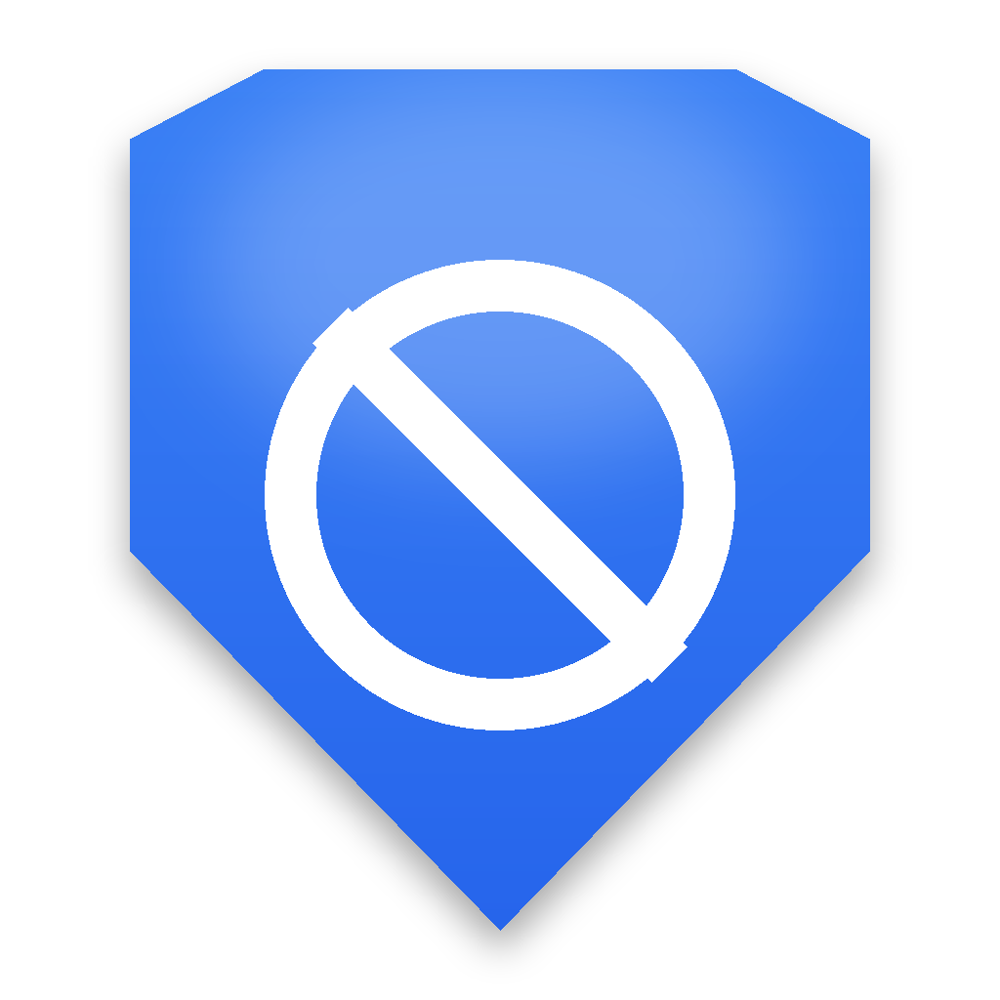

# AntiCasino Shield

AntiCasino Shield is a Windows self-control tool that helps users block
gambling, casino and betting websites.

It is designed as an ethical digital wellbeing tool: no intrusive ads, no
hidden tracking, no gambling promotions, and no silent system changes
without user action.

**This repository hosts the public release, landing page, and documentation
for AntiCasino Shield. The application source code is proprietary and is not
published here.**

## Download

Get the latest installer from the [Releases](../../releases) page of this
repository, or from the official landing page.

1. Download `AntiCasinoShield_Setup_vX.Y.Z.exe` from Releases.
2. Run the installer and accept the license agreement (see `EULA.md`).
3. Launch AntiCasino Shield and click **Enable protection**.

Always download AntiCasino Shield only from this official GitHub repository
or the official project website — never from third-party mirrors.

## Features

- Gambling, casino and betting website blocking through Windows hosts.
- Browser URLBlocklist policy support for Chrome, Edge and Chromium-based
  browsers.
- Custom blocklist for user-added websites.
- Strong protection mode with password and disable delay.
- Days without gambling counter and savings estimate with selectable
  currency.
- Adaptive interface for laptop screens, Full HD displays, resized windows
  and Windows scaling.
- Action and crash logs, hosts backup and restore, full reset/uninstall
  support.
- Privacy-friendly, local-only app — no telemetry, no analytics.

## Administrator rights

AntiCasino Shield can be opened without administrator rights for viewing
logs, settings and local information. Administrator rights are requested
only for system-level actions such as enabling/disabling protection, editing
the hosts file, applying browser policies, restoring hosts backups, or
resetting protection rules — with a clear in-app prompt each time, never
silently.

## Uninstall

AntiCasino Shield uninstalls like a normal Windows application: Windows
Settings -> Apps -> Installed Apps -> AntiCasino Shield -> Uninstall. You can
choose to remove the app only, the app and protection rules, or the app,
rules and local data.

## Windows SmartScreen

Windows SmartScreen may show a warning because AntiCasino Shield is a new
application. This does not automatically mean it is unsafe. Always download
it only from this official repository or the official project page.

## Documentation

- [License](LICENSE.txt) and [End User License Agreement](EULA.md)
- [Privacy Policy](PRIVACY.md)
- [Disclaimer](DISCLAIMER.md)
- [Security Policy](SECURITY.md)
- [Changelog](CHANGELOG.md) / [Release Notes](RELEASE_NOTES.md)

## Landing page

The `landing/` folder contains the static public landing page for AntiCasino
Shield (also viewable at the official project domain).

## Disclaimer

AntiCasino Shield is a self-control support tool. It is not medical,
psychological, financial, or legal advice. It cannot guarantee 100% blocking
of every gambling website. If gambling is seriously affecting your life,
consider contacting professional support services in your country. See
[DISCLAIMER.md](DISCLAIMER.md) for the full text.
